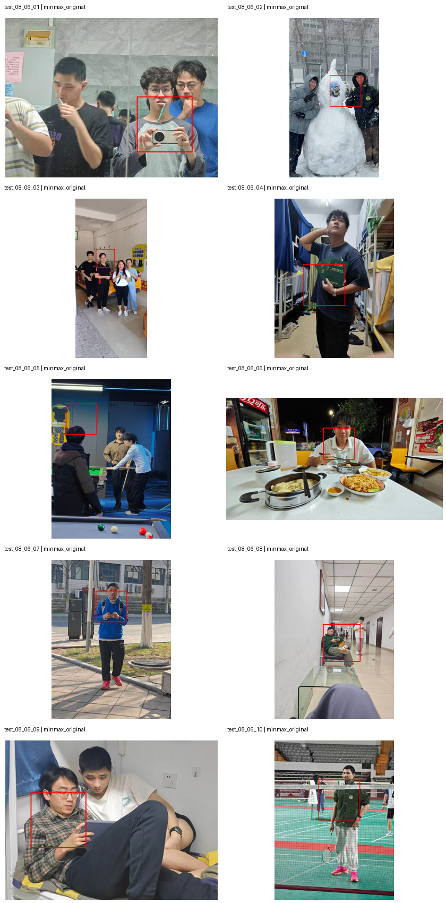

# SLoFo 双图输入、融合尺度与坐标映射实验报告

- 实验日期：2026-08-06（Asia/Shanghai）
- 报告整理时间：2026-08-06 22:17
- 实验项目：`/data/workspace/Gexuri_Project/HYG_LLaVA_SLoFo`
- 本地结果目录：`SLoFo_08_06_实验结果/`
- 实验范围：Scan-Locate、原图+裁切图双图推理、融合尺度诊断、坐标映射对比
- 暂不包含：后续 Focus 四阶段 token 剪枝及其他尚未要求处理的问题

## 1. 本轮结论

1. **双图联合输入已经真实接通。** 每次联合推理在同一个 prompt 中放入两个 `<image>` 占位符，并按“原图、裁切图”的顺序传入两个图像张量。10 个样例的联合输入形状均为 `2 x 3 x 336 x 336`，不是把两张图提前拼成一张，也不是分别推理后手工合并答案。
2. **找到了语义分支数值很小的两个原因。** 一是伪 token 置信度很高，`log_probability` 接近 0，导致梯度本身较小；二是原 FP16 路径先计算 `attention * gradient`，大量约 `1e-8` 的结果直接下溢成 0。
3. **FP16 下溢已经修复。** 现在会先把 attention 和 gradient 转成 FP32，再相乘。样例 01 中非零语义 token 从 `18/576` 恢复到 `576/576`。
4. **修复精度仍不能消除分支量级差。** 10 张图中，结构分支最大值仍是语义分支最大值的约 **890 万至 1.46 亿倍**。这不是单纯的 FP16 bug，而是两个分支定义出的原始数值本来就不在同一尺度。
5. **当前最好的扫描配置是 `minmax + original`。** 四种组合人工核对结果为：raw/original 约 5/10、raw/padded 约 5/10、minmax/original 约 8/10、minmax/padded 约 8/10。归一化的影响明显大于坐标映射方式；在并列情况下，原图坐标裁切更直观，部分样例包含目标上下文更完整，因此暂定为默认。
6. **当前仍有两个明确失败样例。** 样例 03 和 05 都是在扫描阶段选错语义峰值，并非裁切坐标发生了固定方向的偏移。

## 2. 模型与运行环境

| 项目 | 配置 |
|---|---|
| 基础模型 | LLaVA-1.5-7B |
| LLaVA checkpoint | `liuhaotian/llava-v1.5-7b` |
| checkpoint revision | `4481d270cc22fd5c4d1bb5df129622006ccd9234` |
| Vision Tower | `openai/clip-vit-large-patch14-336` |
| Vision Tower revision | `ce19dc912ca5cd21c8a653c79e251e808ccabcd1` |
| 模型精度 | FP16；仅语义显著性乘法显式使用 FP32 |
| 视觉 token | 24 × 24 = 576 |
| 语义层 / 结构层 | 14 / 7 |
| PCA 维度 | 20 |
| 语义权重 beta | 0.7 |
| 随机种子 | 0 |
| 实验 GPU | 空闲的物理 1 号 NVIDIA GeForce RTX 4090 |
| 选卡方式 | 项目 `run_on_empty_gpu.sh` 守卫脚本；未查看其他人的项目或进程命令行 |
| 最高显存记录 | 扫描约 21400.7 MiB；联合生成约 15587.7 MiB |

所有 GPU 实验都通过空卡守卫逐个执行，没有手工占用固定卡，也没有访问其他用户目录。

## 3. 测试图重命名和问题清单

原始图片按原文件保存时间稳定排序后，使用临时中间名避免重名覆盖，再统一命名为 `test_08_06_01.jpg` 至 `test_08_06_10.jpg`。中文问题保存在 `image/test_questions.json`；实际送入当前 LLaVA-1.5 的是等义英文问题，以减少该英文主导模型对中文指令理解的额外干扰。

| 序号 | 中文提问 | 人工参考 |
|---|---|---|
| 01 | 图中双手横握手机拍照的人物的衣服颜色是？ | 灰色，袖子深灰 |
| 02 | 图中站在雪人右侧比剪刀手的人物的衣服颜色是？ | 黑色，带荧光绿色装饰 |
| 03 | 图中站在最前方双手拿水瓶的人物的衣服颜色是？ | 白色上衣 |
| 04 | 图中一只手扶后颈、另一只手抱证书的人物的衣服颜色是？ | 深灰色上衣 |
| 05 | 图中俯身扶着台球桌的人物的衣服颜色是？ | 浅灰蓝色上衣 |
| 06 | 图中坐着用筷子夹食物的人物的衣服颜色是？ | 白色或浅灰色上衣 |
| 07 | 图中站着双手拿手机的人物的衣服颜色是？ | 蓝色上衣 |
| 08 | 图中坐在椅子上翘腿看手机的人物的衣服颜色是？ | 绿色上衣 |
| 09 | 图中躺着手拿平板电脑的人物的衣服颜色是？ | 棕绿色格纹上衣 |
| 10 | 图中站在球网前手拿羽毛球拍的人物的衣服颜色是？ | 深绿色上衣 |

## 4. 双图联合输入实现与验证

`run_slofo_scan_locate.py` 现在统一接受 `list[PIL.Image]`：

1. 根据图像数量生成相同数量的 `<image>` token；
2. 检查 token 数量和图像数量必须严格一致；
3. 依次记录原图单图、裁切图单图、原图+裁切图联合推理；
4. 对四种扫描变体也使用原图+对应裁切图做联合回答；
5. 把 `image_count`、`image_sizes`、`image_tensor_shape` 和显存峰值写入 `result.json`。

10/10 个结果均满足：

```text
image_count = 2
image_tensor_shape = [2, 3, 336, 336]
image_sizes = [原图尺寸, 裁切图尺寸]
```

因此双图数据链路已经完整。当前 10 张图中，联合输入对样例 09 有明显信息补充：原图回答 `black`，裁切图回答 `brown`，联合回答识别到了 `plaid shirt`。不过其余多数样例答案没有变化，所以“链路已实现”和“双图必然提升准确率”要分开看；后者还需要更大的测试集才能下结论。

## 5. 语义分支量级过小的原因

### 5.1 FP16 下溢

以样例 01 的默认 `log_probability` 规划分数为例：

| 指标 | 数值 |
|---|---:|
| 伪 token | `The` |
| 伪 token 概率 | 0.998889 |
| log probability | -0.0011116 |
| 梯度绝对值最大值 | 0.0007796 |
| 梯度绝对值均值 | 0.0001008 |
| FP16 语义图最大值 | 8.34465e-7 |
| FP16 非零 token | 18 / 576 |
| FP16 零值比例 | 96.875% |
| FP32 语义图最大值 | 8.63886e-7 |
| FP32 非零 token | 576 / 576 |

原实现先在 FP16 中计算 attention 与 gradient 的乘积，许多小于 FP16 正常表达范围的正数被舍入成 0。修复方式是：

```python
attention_work = attention.detach().float()
gradient_work = gradient.detach().float()
weighted = attention_work * gradient_work.clamp_min(0)
```

同时新增回归测试，专门检查两个 FP16 `1e-4` 张量相乘后仍能在 FP32 中得到非零 `1e-8`。服务器 CPU 单元测试为 **11/11 通过**。

### 5.2 规划分数本身梯度较小

论文/参考实现使用负交叉熵，等价于对预测伪 token 使用 log probability。模型对首 token 的预测非常自信时，log probability 接近 0，梯度自然较小。诊断模式还对比了 raw logit、probability 和 cross entropy：raw logit 能把语义值放大，但会改变原方法定义；cross entropy 还会反转优化方向。因此当前保留论文一致的 `log_probability`，不通过擅自换分数掩盖尺度问题。

### 5.3 两个分支的原始尺度本来不同

FP32 修复后，样例 01 的语义最大值是 `8.63886e-7`，结构最大值是 `7.6950`，仍相差约 890 万倍。10 张图的结构/语义最大值比值范围是：

- 最小：8,907,464
- 中位数：27,161,688
- 最大：146,470,136

所以 raw 融合 `0.7 * semantic + 0.3 * structure` 几乎完全由结构分支决定。当前显式的 `minmax` 实验先分别把两张图缩放到 `[0, 1]`，再按 beta 融合。它是为解决可比尺度而增加的实验选项，不冒充论文中未明确写出的细节。

## 6. 融合尺度与坐标映射对比

每张图都运行四种组合：

| 融合方式 | 坐标空间 | 人工定位命中 | 结论 |
|---|---|---:|---|
| raw (`none`) | original | 约 5/10 | 结构分支支配，常偏向高结构区域 |
| raw (`none`) | padded | 约 5/10 | 改坐标不能解决错误峰值 |
| 两分支 min-max | original | 约 8/10 | 当前首选 |
| 两分支 min-max | padded | 约 8/10 | 总数持平，但部分框上下文较差 |



四张完整联系表分别保存在：

- `SLoFo_08_06_实验结果/none_original_contact.png`
- `SLoFo_08_06_实验结果/none_padded_contact.png`
- `SLoFo_08_06_实验结果/minmax_original_contact.png`
- `SLoFo_08_06_实验结果/minmax_padded_contact.png`

本组结果不能证明 padded 坐标一定更好。两个 minmax 版本总命中数相同，而样例 01、06 的 original 裁切包含目标动作和上下文更完整。因此当前默认使用 `minmax + original`，同时保留 padded 作为消融选项。

## 7. 当前最佳配置的逐图结果

下面是 `minmax + original` 的结果。定位状态来自对 bbox 图的人工核对；回答状态以“颜色问题是否被回答”为严格标准。

| 序号 | bbox | 原图+裁切图联合回答摘要 | 定位 | 严格回答 |
|---|---|---|---|---|
| 01 | `[792,472,1128,808]` | gray | 正确 | 正确 |
| 02 | `[432,614,768,950]` | black | 正确 | 正确 |
| 03 | `[365,899,701,1235]` | black | 错误 | 错误，应为白色 |
| 04 | `[232,525,568,861]` | black | 正确 | 近似，人工参考为深灰 |
| 05 | `[152,258,488,594]` | black | 错误 | 错误，应为浅灰蓝 |
| 06 | `[1017,312,1353,648]` | white | 正确 | 正确 |
| 07 | `[472,330,808,666]` | blue | 正确 | 正确 |
| 08 | `[518,687,921,1090]` | green | 正确 | 正确 |
| 09 | `[152,312,488,648]` | plaid shirt | 正确 | 部分正确，识别格纹但未回答颜色 |
| 10 | `[352,312,688,648]` | green | 正确 | 正确 |

汇总：定位 **8/10**；严格颜色回答 **6/10 正确、2/10 部分或近似、2/10 错误**。若只判断回答是否大致指向正确衣着属性，则是 8/10，但报告不把“格纹”当作完整的颜色回答。

## 8. 两个失败样例分析

### 样例 03

问题目标是最前方双手拿水瓶、穿白色上衣的人物。语义热图最强热点却落在最左侧黑衣人物的头部；结构图能覆盖多个人物和水瓶，但没有足够强的目标特异性。最终框选中了中间偏左的黑衣人物。raw+padded 偶然能覆盖白衣目标，但这不是稳定的映射规律，因为其余样例没有呈现一致的 padded 优势。

### 样例 05

问题目标是右侧俯身扶台球桌的浅灰蓝上衣人物。语义图的热点主要落在天花板和前景背影附近；结构图虽然能看到人物、球桌和球杆边缘，融合后的最高滑窗仍选到了左上方墙面/前景头部。这个框远离目标，说明问题发生在语义扫描与候选窗口排序，而不是框从 padded 映射回原图时产生了偏移。

后续若继续处理这两个失败点，优先级应是：改善动作短语对应的规划锚点或多 token 语义得分，再研究 top-k 候选重排；不应先继续微调固定坐标偏移。

## 9. 产物与复现入口

### 本地

- 测试问题：`image/test_questions.json`
- 核心实现：`research/slofo/scan_locate.py`
- LLaVA 适配与双图入口：`research/remote_runtime/scripts/run_slofo_scan_locate.py`
- 批量运行脚本：`research/remote_runtime/scripts/run_slofo_08_06_batch.sh`
- 回归测试：`research/tests/test_slofo_scan_locate.py`
- 10 组完整结果：`SLoFo_08_06_实验结果/batch-minmax-fp32/`
- 原始结果压缩包：`SLoFo_08_06_实验结果/slofo-08-06-results.tar.gz`

### 服务器

- 结果：`/data/workspace/Gexuri_Project/HYG_LLaVA_SLoFo/experiments/slofo-08-06/batch-minmax-fp32/`
- 日志：`/data/workspace/Gexuri_Project/HYG_LLaVA_SLoFo/logs/slofo-08-06/`

关键文件 SHA-256：

```text
scan_locate.py
5783C5A259D6CEA6B256D0913ACF19A55E2D13F3F9EB7AB4E51F4199D81E0A5A

run_slofo_scan_locate.py
AA91843C518F908F54307E1BEF62B62C4E587FE5AF914DEBE1036D2B0739A649

run_slofo_08_06_batch.sh
0212EE688EBF4D1A67DCDAE1FC1A773B36F92248341A879C43742D4DC90DA712
```

## 10. 当前状态

本轮要求的三项已经完成：双图联合输入、融合尺度原因定位与修复/对比、10 张本地图的规范命名和顺序实验。当前实现可以继续作为 SLoFo Scan-Locate 学习和后续核心功能复现的基线。尚未解决的是两个复杂多人场景中的语义锚点错误；按本轮要求，Focus 等后续问题暂不展开。
