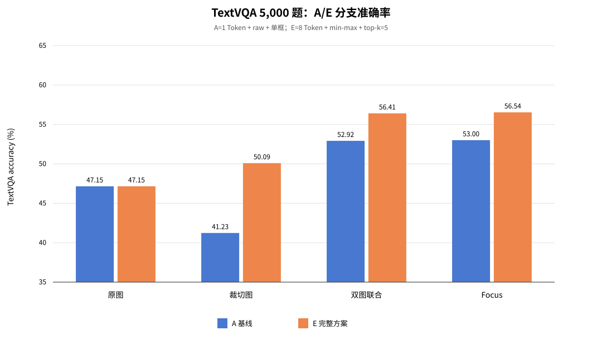
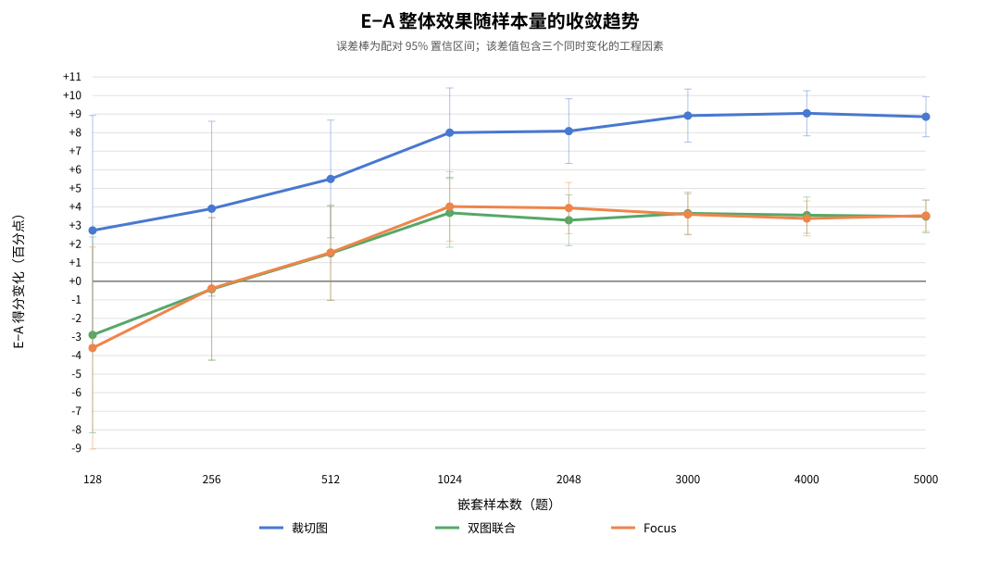
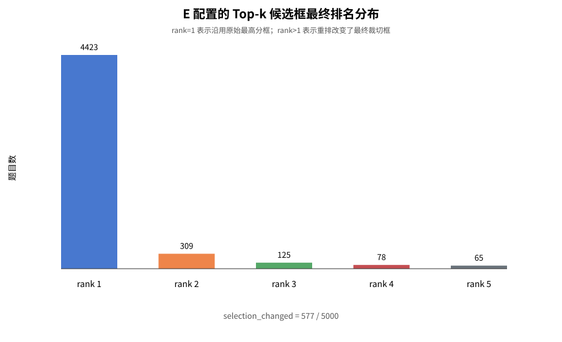
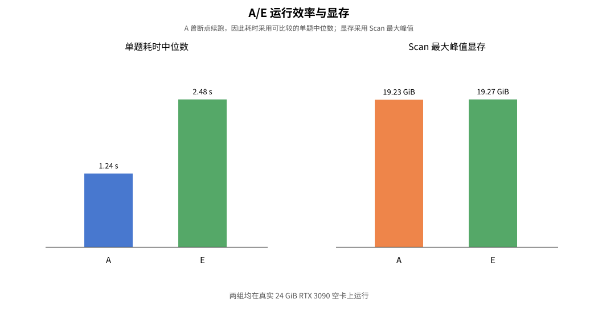

# SLoFo TextVQA 5,000 题全量 A/E 对照实验报告

> 实验日期：2026-08-13 至 2026-08-14  
> 计算平台：学校 Slurm，真实 24 GiB NVIDIA RTX 3090 空卡  
> 当前实现性质：依据论文描述独立完成的工程复现，不是作者未公开代码的完全复现

## 1. 一句话结论

在 TextVQA validation 全部 5,000 题上，E 的 Focus 得分为 **56.536%**，A 为
**53.004%**，E−A 为 **+3.532 个百分点**，配对 95% CI 为
**[+2.684, +4.380]**。400 题得分改善、212 题退化，区间稳定高于 0；E 的
Scan 最大峰值为 **19.27 GiB**，完整实验可在真实 24 GiB RTX 3090 上稳定完成。

## 2. 这次实验回答什么问题

此前 1,024 题 A/B/D/E 因子拆分已经说明 min-max、语义 rollout 和 top-k 在小样本上
分别产生怎样的变化。本轮把验证规模扩展到 TextVQA validation 的全部 5,000 题，
只保留两条最关键路径：

| 配置 | 语义 rollout | 融合 | 候选框 | 角色 |
|---|---:|---|---:|---|
| A | 1 Token | raw / 不归一化 | 单框 | 论文公式直译基线 |
| E | 8 Token | min-max | top-k=5 重排 | 当前完整工程方案 |

本轮主要检验：

1. E 相对 A 的整体增益能否在 5,000 题上保持；
2. 增益的配对置信区间是否稳定跨过 0；
3. Top-k 是否真的改变候选框，以及改变后改善与退化的比例；
4. 24 GiB RTX 3090 是否能稳定完成全量实验；
5. 前 128/256/512/1024 题观察到的趋势是否随样本量收敛。

## 3. 数据、清单与可复现性

- TextVQA 0.5.1 validation：5,000 条问答，3,166 张唯一图片；
- 固定 seed：`20260813`；
- 固定清单 SHA-256：`af133e3dcc2e4096f122dcdff4560fdfe95e745c2837f60f3f375cbcad499b90`；
- 前 1,024 题与上一轮四配置清单严格一致；
- LLaVA / SLoFo 运行配置、模型 revision 和结果文件均固定在实验日志中。

### 3.1 提示词分层边界

为了保持嵌套清单不变，前序 512 题沿用 LLaVA TextVQA OCR question file 的
`Reference OCR token` 辅助提示，另外 4,488 题使用原始问题加简短作答要求。
A 与 E 对同一道题使用完全相同的提示，因此 **E−A 配对比较公平**；但混合提示下
的绝对准确率不应直接当作统一纯问题提示的官方排行榜成绩。本报告同时给出两种
提示词的分层结果。

### 3.2 断点续跑检查

A 首次运行到 203 题时按计划安全暂停，本轮从第 204 题继续。当前 A 的前 1,024
题与上一轮独立 A/1024 结果逐字段比较：五个答案分支、裁切框和候选排名的差异
均为 `0/1024`。只有 CUDA 显存峰值测量存在轻微波动，不影响模型功能输出。

详细记录：[TextVQA5000 A/E断点与复现一致性检查](TextVQA5000_AE断点与复现一致性检查.md)

## 4. 全量准确率结果

| 分支 | A 准确率 | E 准确率 | E−A |
|---|---:|---:|---:|
| 原图 | 47.152% | 47.152% | 0.000 pp |
| 裁切图 | 41.234% | 50.092% | +8.858 pp |
| 双图联合 | 52.920% | 56.406% | +3.486 pp |
| Focus | 53.004% | 56.536% | +3.532 pp |

原图分支在 A/E 中逐题完全一致，说明差异确实来自定位、融合和 Focus 路径，而
不是基础 LLaVA 输出漂移。E 的 Focus 相对同一配置的原图提高 **+9.384 pp**；
A 的 Focus 相对原图提高 **+5.852 pp**。E 的完整工程增强在 A 已有收益之上再增加
3.532 pp。

## 5. 配对统计：改善、退化与置信区间

| 分支 | E−A（百分点） | 配对 95% CI | 答案改变 | 得分改善 | 得分退化 |
|---|---:|---:|---:|---:|---:|
| 裁切图 | +8.858 | [+7.779, +9.937] | 1,945 | 724 | 253 |
| 双图联合 | +3.486 | [+2.609, +4.363] | 1,258 | 418 | 231 |
| Focus | +3.532 | [+2.684, +4.380] | 1,224 | 400 | 212 |

三条关键分支的 95% CI 均完全位于 0 以上。裁切图增益最大，说明 min-max 与更完整
的语义信号首先改善了定位框本身；联合输入把不稳定裁切图重新放回原图上下文后，
保留了约 3.5 pp 的净收益。Focus 的改善题数约为退化题数的 1.89 倍，但仍有
212 个明确退化案例，不能只展示平均分而忽略失败样本。

## 6. 样本规模收敛趋势

Focus 的 E−A 在 128、256、512 题时分别为 −3.594、−0.391、+1.543 pp，置信区间
均跨过 0；到 1,024 题变为 **+4.023 pp [ +2.152, +5.895 ]**，此后在
2,048、3,000、4,000、5,000 题稳定在 +3.38 至 +3.94 pp。这个结果直接说明：
此前 128 题规模不足以判断完整方案，1,024 题后方向才稳定，全量结果最终收敛到
+3.532 pp。

## 7. OCR 辅助提示与纯问题提示分层

| 提示词分层 | 题数 | A Focus | E Focus | E−A Focus |
|---|---:|---:|---:|---:|
| OCR 辅助提示 | 512 | 60.059% | 61.602% | +1.543 pp |
| 纯问题提示 | 4,488 | 52.199% | 55.958% | +3.759 pp |

OCR 辅助层的 Focus 差值 95% CI 为 [−1.018, +4.104]，仍跨过 0；纯问题层为
**+3.759 pp [ +2.861, +4.657 ]**。因此全量正向结论主要由占比 89.76% 的纯问题
提示支撑，不是依靠 OCR token 辅助获得。OCR 层绝对分数更高，也进一步说明混合
提示的总准确率不适合作为统一提示下的官方排行榜分数。

## 8. Top-k 候选框重排的实际触发情况

- E 中最终候选框不是 rank 1 的题目：577 / 5,000（11.54%）；
- rank 1–5 分布：4,423 / 309 / 125 / 78 / 65；
- A 与 E 最终框不同：3,551 / 5,000。

在同一个 E 配置内部，top-k 双图得分为 56.406%，legacy 单框双图为 55.628%，
即候选框重排自身贡献 **+0.778 pp**。两者有 204 个答案发生变化，其中 76 题改善、
31 题退化。注意 577 次选框变化不必然导致答案变化；同时 A/E 的 3,551 个框差异
还包含 min-max 与多 Token 语义信号的影响，不能全部归因给 top-k。

## 9. 运行效率与显存

| 配置 | 可比较单题中位耗时 | Scan 最大峰值 | 完成情况 |
|---|---:|---:|---|
| A | 1.238 s | 19.23 GiB | 203 题 + 断点续跑至 5,000 |
| E | 2.485 s | 19.27 GiB | 单次串行完成 5,000 |

E 的单题中位耗时约为 A 的 **2.01 倍**，主要因为 top-k 候选框需要额外联合回答；
但最大 Scan 显存只增加约 37 MiB。A 两次 Slurm 作业合计 1:55:51，E 单次作业
3:39:25。两组峰值均低于此前设定的 22 GiB 目标，也低于 24 GiB 卡的物理上限。

## 10. 与 1,024 题因子消融及原论文的关系

### 10.1 与 1,024 题因子消融

1,024 题时 E−A Focus 为 +4.023 pp，全量为 +3.532 pp，方向一致、幅度略回落
0.491 pp。上一轮单因素配对结果为：min-max +2.939 pp、多 Token −0.244 pp、
top-k +1.328 pp；三者合计与 1,024 题 E−A 基本一致。全量只运行 A/E 两条路径，
因此用来确认整体方案外推稳定性；单因素因果解释仍应引用 1,024 题 A/B/D/E 消融。

### 10.2 与原论文的对照边界

当前代码已经实现并验证：Scan–Locate、双图输入、Focus 四阶段剪枝、语义 rollout、
min-max 融合以及 top-k 候选框重排。需要严格区分：

- Scan–Locate 与 Focus 是围绕目标论文描述完成的独立工程实现；
- min-max 和 top-k 是为解决数值尺度及候选框稳定性加入的工程增强；
- E−A 同时包含三个变化，属于整体系统对照，不是单因素因果消融；
- 作者代码未公开，所以本实验不能声称与作者实现逐行或逐模块完全一致；
- 本轮混合两种提示格式，绝对分数不能直接冒充 TextVQA 官方排行榜成绩。

## 11. 失败案例与后续优化

E−A 的 Focus 答案共有 1,224 题改变：400 题得分改善、212 题得分退化，另外 612
题虽然答案文本变化，但 TextVQA 共识得分不变。E 内部 Focus 相对 top-k 双图有
442 个答案变化，改善和退化题数均为 88，最终只增加 0.130 pp。这说明当前主要收益
来自更好的定位与双图联合；四阶段 Focus 剪枝总体能保留收益，但自身净提升很小，
后续应重点检查 212 个 E−A 退化案例以及 Focus 改写答案却不增分的案例。

下一步建议：

1. 从 E 改善与退化样本中各抽取高置信复杂案例，联动显著图、候选框和答案分析；
2. 若需要官方排行榜口径，另建统一纯问题提示的 5,000 题清单并独立运行；
3. 在 GQA 与 POPE 上复用相同 A/E 固定入口，检查定位增强是否伤害通用理解和幻觉抑制；
4. 继续保留 A/B/D/E 因子拆分，避免把完整工程方案的效果错误归因给单个模块。

## 12. 产物索引

- `textvqa5000_AE_compare.json`：全量汇总和配对统计；
- `textvqa5000_AE_cases.csv`：5,000 题逐题答案、得分与框变化；
- `focus_improved_400.csv`、`focus_regressed_212.csv`：E−A Focus 改善与退化清单；
- `focus_changed_same_score_612.csv`：答案改变但共识得分不变的清单；
- `topk_reranked_577.csv`：E 中实际选择 rank>1 候选框的清单；
- `A_1token_raw_single/`、`E_8token_minmax_topk5/`：服务器原始输出副本；
- `figures/`：报告图表；
- `make_textvqa5000_figures.py`：图表再生成脚本；
- `ARTIFACT_SHA256.txt`：关键报告、原始输出、分析表和图表的完整性哈希；
- `TextVQA5000_AE断点与复现一致性检查.md`：A/E 断点与复现一致性检查。
